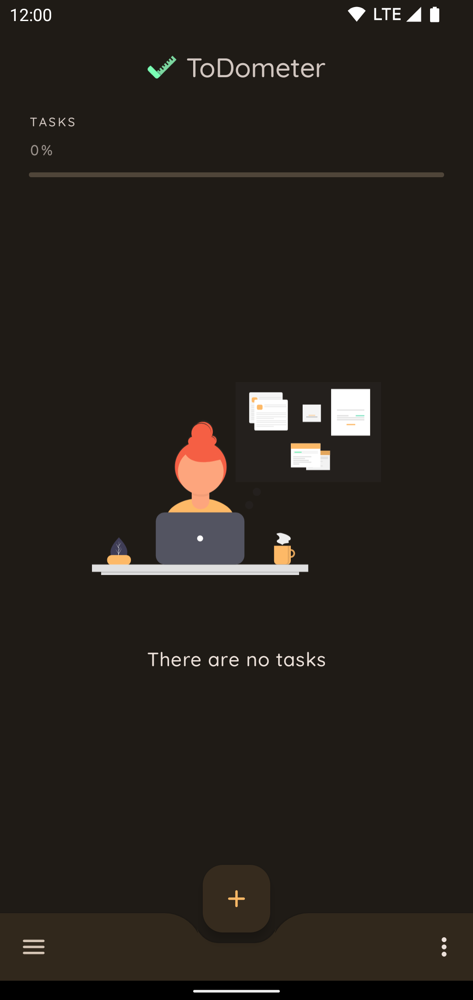
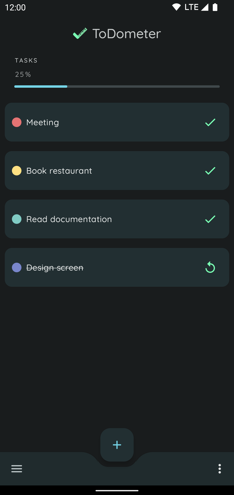
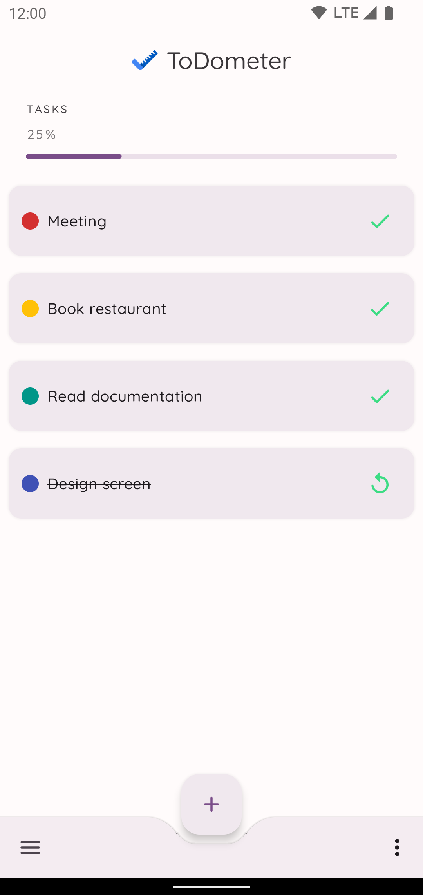
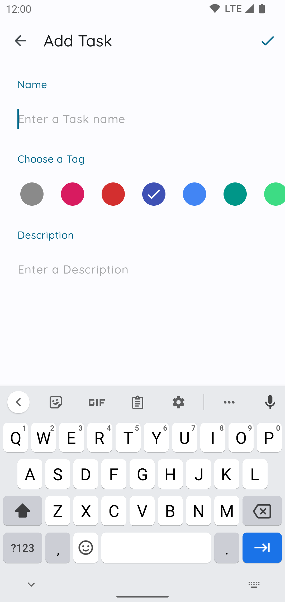
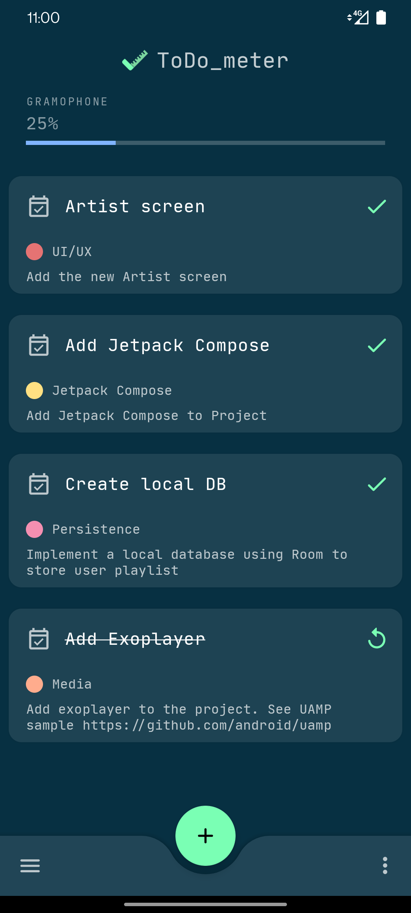

<h1 align="center">ToDometer</h1> 

<h5 align="center">
✅ A meter to-do list built with Android Jetpack based on https://cassidoo.github.io/todometer/
</h5>

🚧 Migration to Kotlin Multiplatform: https://github.com/serbelga/ToDometerKotlinMultiplatform

## Tech Stack
* Kotlin & Coroutines
  * Flow
* [Android Jetpack](https://developer.android.com/jetpack)
  * [Android KTX](https://developer.android.com/kotlin/ktx)
  * [Navigation](https://developer.android.com/guide/navigation)
  * [ViewModel](https://developer.android.com/topic/libraries/architecture/viewmodel)
  * [LiveData](https://developer.android.com/topic/libraries/architecture/livedata)
  * [Room](https://developer.android.com/topic/libraries/architecture/room)
  * [DataStore](https://developer.android.com/topic/libraries/architecture/datastore)
  * [DataBinding](https://developer.android.com/topic/libraries/data-binding)
  * [ViewBinding](https://developer.android.com/topic/libraries/view-binding)
  * [MotionLayout](https://developer.android.com/training/constraint-layout/motionlayout)
* [Dagger Hilt](https://dagger.dev/hilt/)
* [ktlint](https://ktlint.github.io/)
* [Material Components for Android](https://github.com/material-components/material-components-android)
  * [Material Theming](https://material.io/design/material-theming/overview.html)
  * [Dark Theme](https://material.io/design/color/dark-theme.html)
  * [Motion](https://material.io/develop/android/theming/motion)
  * [Dynamic color](https://m3.material.io/styles/color/dynamic-color/overview)

## Resources
* List illustrations: https://undraw.co/

## Dynamic color

 |  |  |  |  |
--- | --- | --- | --- | --- |

## Screenshots

<h3 align="center">⚪ ⚫ Light and Dark theme</h3> 

 

