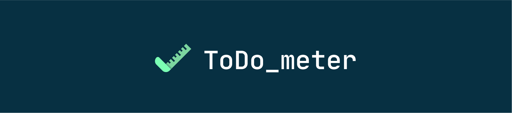
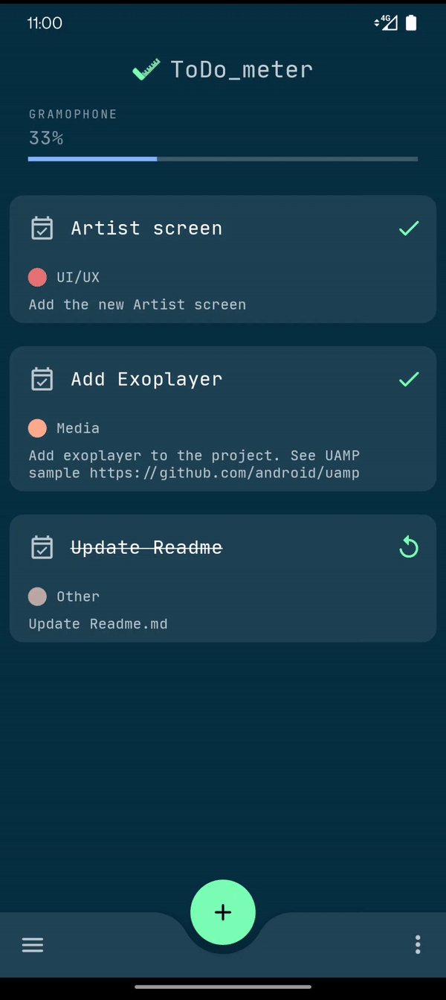
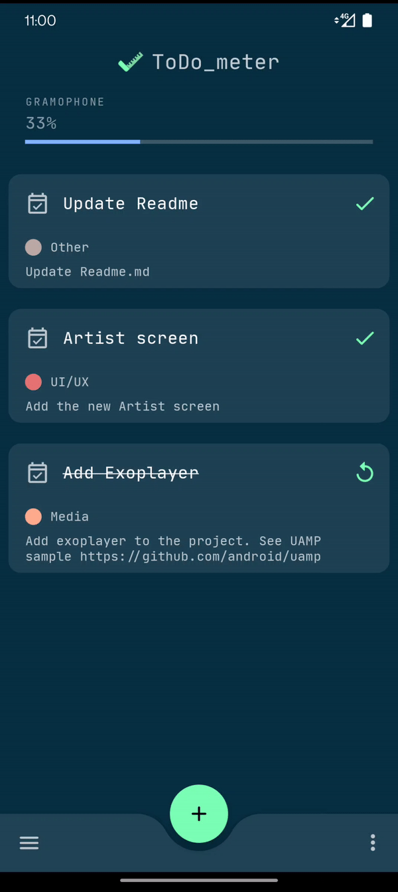
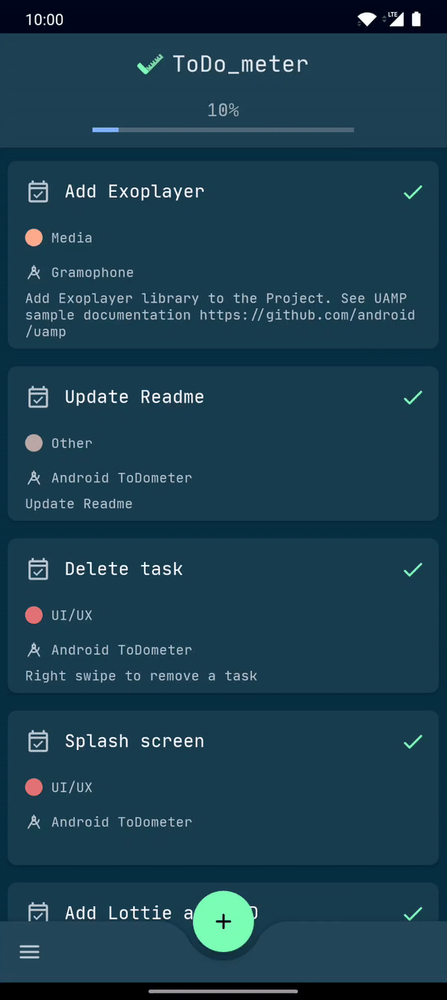
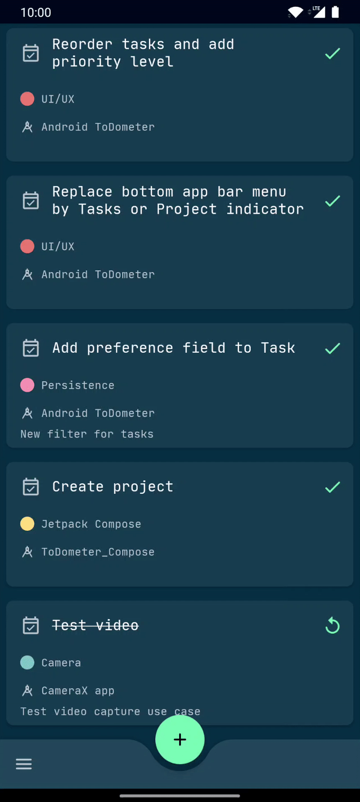

<h1 align="center">ToDo_meter</h1> 

<h5 align="center">
✅ A meter to-do list built with Android Jetpack based on https://cassidoo.github.io/todometer/
</h5>

## Tech Stack
* Kotlin & Coroutines
  * Flow
* [Android Jetpack](https://developer.android.com/jetpack)
  * [Android KTX](https://developer.android.com/kotlin/ktx)
  * [Navigation](https://developer.android.com/guide/navigation)
  * [ViewModel](https://developer.android.com/topic/libraries/architecture/viewmodel)
  * [LiveData](https://developer.android.com/topic/libraries/architecture/livedata)
  * [Room](https://developer.android.com/topic/libraries/architecture/room)
  * [Paging](https://developer.android.com/topic/libraries/architecture/paging)
  * [DataBinding](https://developer.android.com/topic/libraries/data-binding)
  * [ViewBinding](https://developer.android.com/topic/libraries/view-binding)
  * [MotionLayout](https://developer.android.com/training/constraint-layout/motionlayout)
* [Koin](https://insert-koin.io)
* [ktlint](https://ktlint.github.io/)
* [Material Components for Android](https://github.com/material-components/material-components-android)
  * [Material Theming](https://material.io/design/material-theming/overview.html)
  * [Dark Theme](https://material.io/design/color/dark-theme.html)
  * [Material Container Transform](https://material.io/develop/android/theming/motion)

Add ToDo | Check Done | Edit Task | Delete Task
--- | --- | --- | ---
 |  |  | 

<h3 align="center">⚪⚫ Light and Dark themes</h3> 

 

